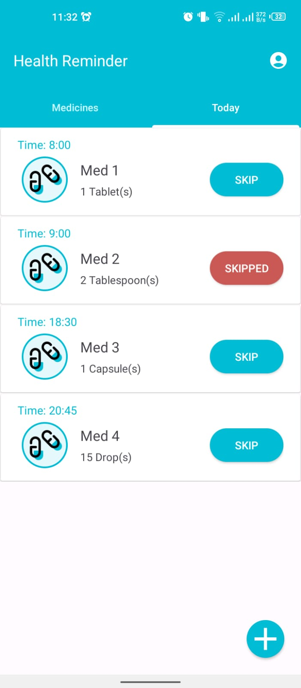

# Health Reminder App

## Introduction

The Medication Manager App is a user-friendly Android application designed to help users efficiently manage their medications. This app allows users to add, update, and delete medicines, along with setting specific times for medication intake. Furthermore, it provides medication reminders through notifications to ensure users never miss a dose.

## Features

- **Medication Management**: Easily add, update, or delete medications.
- **Custom Medication Schedules**: Set precise times for taking each medication.
- **Medication Reminders**: Receive timely notifications for medication intake.
- **User-Friendly Interface**: Intuitive design for a seamless user experience.
- **Data Backup**: Securely store medication data for peace of mind.
- **Offline Access**: Use the app even without an internet connection.
- **Personalized Profiles**: Create individual profiles for different users.
- **Accessibility**: Designed with accessibility in mind for all users.

## Screenshots

## Installation

To use the Medication Manager App, follow these steps:

1. Clone this repository to your local machine: git clone [https://github.com/Shahroze16602/HealthReminder]()

2. Open the project in Android Studio.

3. Build and run the app on your Android device or emulator.

## Usage

1. Open the app and create a new user profile or log in if you already have one.

2. Navigate to the "Medications" section.

3. Add your medications by providing details such as name, dosage, and schedule.

4. Set the specific times for each medication.

5. Save the medication details.

6. The app will send you notifications at the scheduled times to remind you to take your medication.

7. You can also update or delete medications as needed.

## Support

If you encounter any issues or have questions about using the app, please [open an issue](https://github.com/Shahroze16602/HealthReminder/issues) on the GitHub repository.
